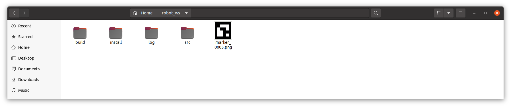
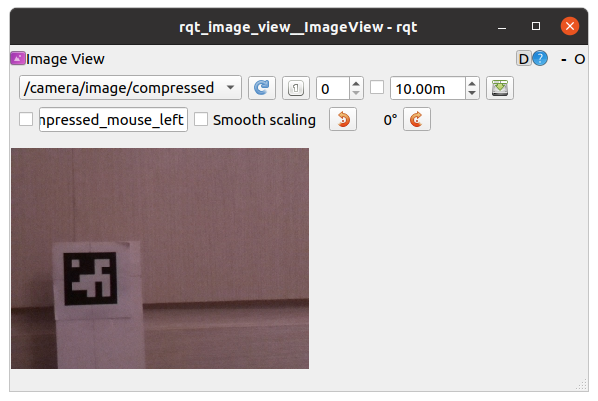

---

## 터틀봇3 라즈베리파이 카메라를 이용한AR 마커 인식


**빌드 환경 :**  colcon **/** Ubuntu 20.04 **/** Foxy

---

ROS에서 AR마커를 인식하고, 마커와 카메라 사이의 위치관계를 토픽으로 발행하는 대표적인노드 패키지로는 `ros2_aruco`가 있으며 아래 링크에서 배포받을 수 있다.

**`ros2_aruco`공식 배포처:** https://github.com/JMU-ROBOTICS-VIVA/ros2_aruco 

`ros2_aruco`패키지를 `ros2_ws/src`에서 `git clone`하여 빌드 시 에러가 발생하기도 하고, 터틀봇3의 라즈베리파이에 연결된 라즈베리파이 카메라를 마커 인식을 위한 영상 소스로 사용하기 위해서 몇가지 필요한 작업도 있어 필요한 코드를 추가, 수정한 버전을 만들었다. 이 수정 버전을 이용하여 터틀봇3의 라즈베리파이에 설치한, 라즈베리파이 카메라 영상으로부터 AR 마커를 인식시켜보자.

#### 1. `ros2_aruco`패키지 설치

`ros2_aruco`터틀봇3를 위한 수정 버전`ros2_aruco` 소스코드 복제를 위한 임시 작업 폴더 생성

```bash
mkdir ~/temp
```


`ros2_aruco`터틀봇3를 위한 수정 버전 `ros2_aruco`소스코드 복제를 위한 임시 작업폴더로 작업경로 변경

```bash
cd ~/temp
```


`ros2_aruco`터틀봇3를 위한 수정 버전 `ros2_aruco`소스코드 복제

```bash
git clone https://github.com/greattoe/ros2_aruco4tb3.git
```


복제된 `ros2_aruco`터틀봇3를 위한 수정 버전 `ros2_aruco`소스코드 폴더로 작업경로 변경

```bash
cd ~/temp/ros2_aruco4tb3
```


`ls`명령으로 `ros2_aruco`  `ros2_aruco_interfaces`패키지 폴더 확인

```bash
ls
README.md  ros2_aruco  ros2_aruco_interfaces
```


`ros2_aruco`  `ros2_aruco_interfaces`패키지 폴더를 `~/robot_ws/src`로 복사

```bash
cp -r ros2_aruco* ~/robot_ws/src/
```


빌드 위해 ROS 워크스페이스로 작업경로 변경

```bash
cd ~/robot_ws/
```


빌드

```bash
colcon build --symlink-install
```


새로 빌드된 패키지 정보를 사용자 `shell`환경에 반영

```bash
source ~/robot_ws/local_seup.bash
```


빌드 결과 테스트를 위해 다음 명령으로 마커생성 노드를 구동해보자. 생성될 마커의 id는 5, size는 300 pixel, 참조할 dictionary는 4X4_50

```bash
ros2 run ros2_aruco aruco_generate_marker --id 5 --size 300 --dictionary DICT_4X4_50

```

- `--id`: 생성할 마커 ID (예: 5)
- `--size`: 출력 PNG 이미지의 한 변의 길이 (픽셀 단위, 예: 300 → 300 pixel x 300pixel 이미지)
- `--dictionary`: 마커를 생성할 때 사용할 ArUco 딕셔너리 이름
   (예: `DICT_4X4_50`, `DICT_5X5_100`, `DICT_6X6_250` 등)

### 지원되는 딕셔너리 목록 예시:

- `DICT_4X4_50`

- `DICT_4X4_100`

- `DICT_5X5_100`

- `DICT_6X6_250`

- `DICT_7X7_1000`

  `ls`명령으로 생성된 마커 이미지 파일 확인

```bash
ls
build  install  log  marker_0005.png  src
```

탐색기 화면에서는 다음과 같이 확인된다.



`ros2_aruco`패키지에 어떤 노드가 있는지 알아보기 위해`ls ~/robot_ws/src/ros2_aruco/ros2_aruco/*.py`명령을 실행한다.  

```bash
~$ ls ~/robot_ws/src/ros2_aruco/ros2_aruco/*.py
/home/gnd0/robot_ws/src/ros2_aruco/ros2_aruco/aruco_generate_marker.py
/home/gnd0/robot_ws/src/ros2_aruco/ros2_aruco/aruco_node.py
/home/gnd0/robot_ws/src/ros2_aruco/ros2_aruco/aruco_raspicam2.py
/home/gnd0/robot_ws/src/ros2_aruco/ros2_aruco/aruco_usbcam.py
/home/gnd0/robot_ws/src/ros2_aruco/ros2_aruco/img_compressed2raw.py
/home/gnd0/robot_ws/src/ros2_aruco/ros2_aruco/__init__.py
/home/gnd0/robot_ws/src/ros2_aruco/ros2_aruco/transformations.py
```

**`aruco_generate_marker.py`**

: 앞서 살펴본 마커 이미지 생성 노드 실행 `entry_point`.

- **`aruco_node.py`**

:`ros2_aruco`공식 배포처에서 제공한 마커인식 원본 코드.

- **`aruco_usbcam`**

:내장 웹캠이나 USB 카메라 영상(`usb_cam_node`)으로 부터 마커를 인식하도록 `aruco_node.py`를 편집한 노드 코드

- **`aruco_raspicam2.py`**

: 터틀봇에 설치한 라즈베리파이 카메라 영상(`raspi_cam2_node`)으로 부터 마커를 인식하도록 `aruco_node.py`를 편집한 노드 코드

- **`img_compressed2raw.py`**

: 터틀봇에 설치한 라즈베리파이 카메라를 구동하면 발행되는 `/camera/image/compressed`를 구독하여 `ros2_aruco`패키지가 구독하는 `/image_raw`토픽으로 변환하여 발행하는 노드 코드로, 터틀봇3에서 `raspicam2_node` 구동 후 이 코드를 실행하면 `ros2 topic list`실행 결과에 `/image_raw`가 나타난다. 따라서 커틀봇3에 설치한 라즈베리파이 카메라를 사용하여 AR마커를 인식하려면

1. **라즈베리파이 카메라 구동**

   : 라즈베리파이에 `ssh`연결 후, 다음 명령 실행.

   ```bash
    ros2 run raspicam2 raspicam2_node --ros-args --params-file `ros2 pkg prefix raspicam2`/share/raspicam2/cfg/params.yaml
   ```

   `ros2 topic list`명령을 실행하여 `/camera/image/camera_info`토픽과 `/camera/image/compressed`토픽을 확인 후, `rqt`로 영상확인을 위해 다음 명령을 실행한다. 

   ```
   ros2 run rqt_image_view rqt_image_view
   ```

   

2. **`/camera/image/compressed`토픽을 `/image_raw`토픽으로 변환**

   : PC에서 다음 명령 실행

   ```
   ros2 run ros2_aruco img_compressed2raw
   ```

   `ros2 topic list`명령을 실행하여 토픽과 `/camera/image_raw`토픽을 확인

   3. **`ros2_aruco`패키지 실행**

   : PC에서 다음 명령 실행

   ```
   ros2 run ros2_aruco aruco_raspicam2
   ```

   
   
   
   
   
   
   
   
   
   
   `ar_track`패키지의 `keep_dist`노드 실행순서
   
   1. **라즈베리파이**에서 다음 명령으로 카메라 구동
   
      ```bash
      ros2 run raspicam2 raspicam2_node --ros-args --params-file `ros2 pkg prefix raspicam2`/share/raspicam2/cfg/params.yaml
      ```
   
      2. **라즈베리파이**에서 다음 명령으로 터틀봇3 브링업
   
         ```bash
          ros2 launch turtlebot3_bringup robot.launch.py
         ```
   
         3. **노트북**에서 다음 명령으로 `rqt_image_view`실행
   
         4. ```
            ros2 run rqt_image_view rqt_image_view
            ```
   
         5. **노트북**에서 다음 명령으로 `img_compressed2raw`실행
   
         6. ```
            ```
   
         7. 


| 순서 | PC(노트북) | SBC(라즈베리파이) |
| ---- | ---------- | ----------------- |
| 1    |            | 카메라 구동       |
| 2    |            | 브링업            |
| 3    |            |                   |
|      |            |                   |
|      |            |                   |


---


[튜토리얼 목록](../README.md) 


