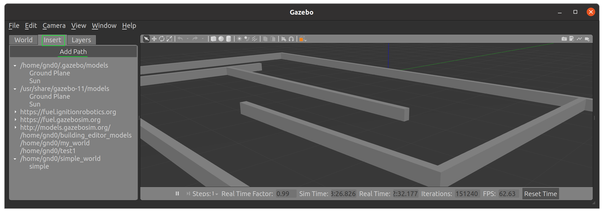

## ✅ 사용자 작성 `world`에서의 Trtlebot3 `gazebo` 시뮬레이션

**튜토리얼 레벨 :**  중급

**빌드 환경 :**  colcon **/** Ubuntu 20.04 **/** Foxy

---


**1. world 작성**

`gazebo` `building editor`에서 사용자 월드를 작성 후 `Save World As`메뉴에서 작성한 월드를 저장한다.

`~/simple_world/simple_world.world`로 저장했다면 다음 명령으로 저장한 월드가 `gazebo`시뮬레이션 환경에 로드(Load)되는 지 확인한다. 

```
gazebo ~/simple_world/simple_world.world
```

현 상태에서 `topic list`를 확인하면 다음과 같다.

```
ros2 topic list 
/parameter_events
/rosout
```

터틀봇3와 관련된 토픽이 나타나려면 `gazebo`화면의 `world`, `insert` `layer`3개의 탭 중 `insert`탭에서 `TurtleBot3(Burger)`를 선택, 삽입할 수 있는데 현재는 `insert`탭의 `Add Path`항목에 나타나지 않는 것을 알 수 있다.



**✅ 해결 방법: ROS2 Launch로 `gazebo_ros`와 함께 Gazebo 실행**

이를 위해선 `empty_world.launch.py`를 통해 구동해야 하지만 `empty_world.launch.py`는 `gazebo_ros` 패키지에는 기본적으로 포함되어 있지 않으며, 이는 ROS 2에서 사용자 정의로 만들어줘야 한다.

다음은 `empty_world.launch.py`를 새로 작성하고,사용자가 작성한 월드 (`$HOME/simple_world/simple_world.world`)를 로드하는 방법이다.

**✅ 1. 패키지 생성**

```bash
cd ~/ros2_ws/src
ros2 pkg create my_gazebo_launch --build-type ament_python

```


**✅ 2. 디렉토리 구조**

```bash
my_gazebo_launch/
├── launch/
│   └── empty_world.launch.py
├── my_gazebo_launch/
│   └── __init__.py
├── package.xml
└── setup.py

```


**✅ 3. `launch/empty_world.launch.py`**

```python
from launch import LaunchDescription
from launch.actions import DeclareLaunchArgument
from launch.substitutions import LaunchConfiguration
from launch_ros.actions import Node
from launch.actions import IncludeLaunchDescription
from launch.launch_description_sources import PythonLaunchDescriptionSource
from ament_index_python.packages import get_package_share_directory

import os

def generate_launch_description():
    world_arg = DeclareLaunchArgument(
        'world',
        default_value=os.path.join(get_package_share_directory('gazebo_ros'), 'worlds', 'empty.world'),
        description='Full path to the world model file to load'
    )

    return LaunchDescription([
        world_arg,
        IncludeLaunchDescription(
            PythonLaunchDescriptionSource(
                os.path.join(get_package_share_directory('gazebo_ros'), 'launch', 'gazebo.launch.py')
            ),
            launch_arguments={'world': LaunchConfiguration('world')}.items()
        )
    ])

```


**✅ 4. `setup.py`**

```python
from setuptools import setup
import os
from glob import glob

package_name = 'my_gazebo_launch'

setup(
    name=package_name,
    version='0.1.0',
    packages=[package_name],
    data_files=[
        ('share/' + package_name + '/launch', glob('launch/*.launch.py')),
        ('share/' + package_name, ['package.xml']),
    ],
    install_requires=['setuptools'],
    zip_safe=True,
    maintainer='Your Name',
    maintainer_email='your@email.com',
    description='Launch custom Gazebo world',
    license='Apache License 2.0',
    tests_require=['pytest'],
    entry_points={
        'console_scripts': [],
    },
)

```


**✅ 5. `package.xml`**

```xml
<?xml version="1.0"?>
<package format="3">
  <name>my_gazebo_launch</name>
  <version>0.1.0</version>
  <description>Launch custom Gazebo world</description>

  <maintainer email="your@email.com">Your Name</maintainer>
  <license>Apache License 2.0</license>

  <buildtool_depend>ament_cmake</buildtool_depend>
  <buildtool_depend>ament_python</buildtool_depend>

  <exec_depend>launch</exec_depend>
  <exec_depend>launch_ros</exec_depend>
  <exec_depend>gazebo_ros</exec_depend>

  <export>
    <build_type>ament_python</build_type>
  </export>
</package>

```


**✅ 6. 빌드 및 실행**

```bash
cd ~/ros2_ws
colcon build --packages-select my_gazebo_launch
source install/setup.bash
ros2 launch my_gazebo_launch empty_world.launch.py world:=/$HOME/simple_world/simple_world.world

```


이 번에는  `insert`탭의 `Add Path`항목중에 서 `TurtleBot3(Burger)`가 나타난 것을 확인할 수 있다.


이 번에는  `insert`탭의 `Add Path`항목중 `TurtleBot3(Burger)`를 클릭하면 다음과 같이 로봇이 나타나 마우스 포인터를 따라 다니는 것을 확인할 수 있다.


마우스를 움직여 원하는 위치에서 클릭하면, 다음 그림과 같이 해당 위치로 로봇이 소환된다.


이제 `topic list`를 확인해보면 다음과 같이 터틀봇3 관련 토픽들이 나타난 것을 확인할 수 있다. 

```
ros2 topic list 
/clock
/cmd_vel
/imu
/joint_states
/odom
/parameter_events
/performance_metrics
/rosout
/scan
/tf
```


[튜토리얼 목록](../README.md) 
