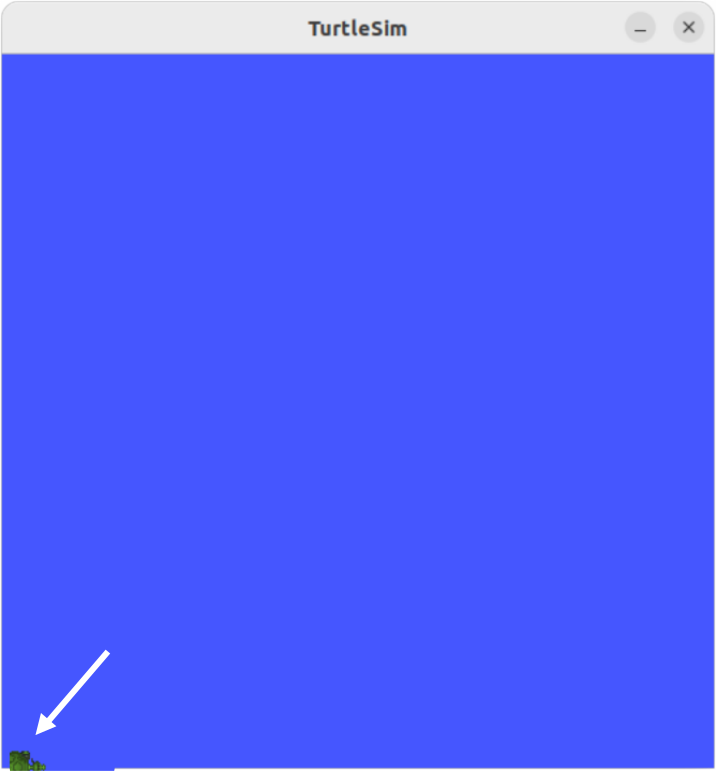
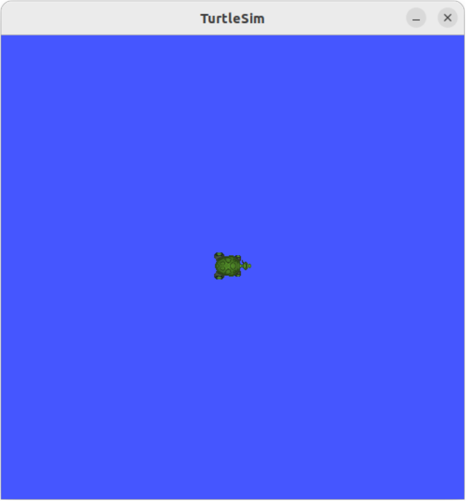
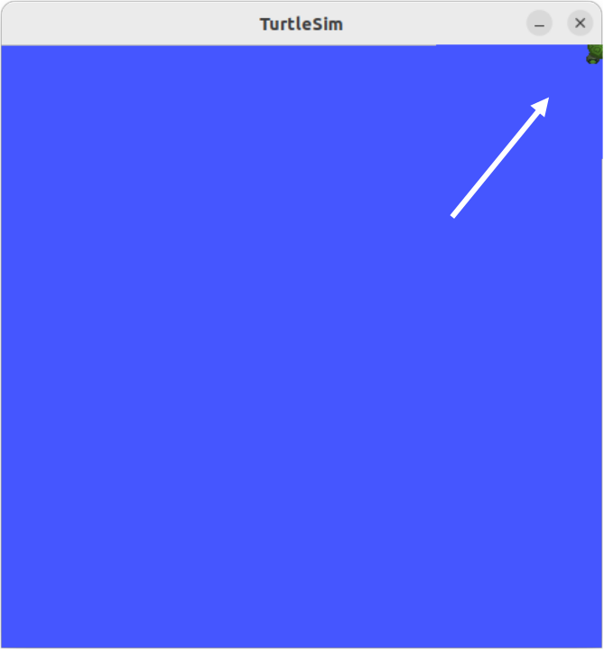

## rclpy_tutorial/ turtlesim/how2_subscribe_turtle_pose

##  

**참조 :**<https://docs.ros.org/en/humble/Tutorials/Beginner-Client-Libraries/Writing-A-Simple-Py-Publisher-And-Subscriber.html>  

**튜토리얼 레벨 :**  초급

**빌드 및 운영 환경 :**  colcon **/** Ubuntu 22.04 **/** Humble


#### `turtlesim`  거북이의 `pose`토픽 구독노드 작성#### 

##### `pose`토픽

`turtlesim`패키지의 `turtlesim_node`를 구동 후, `ros2 topic list`명령을 실행한 결과는 다음과 같다.

```
 ros2 topic list 
/parameter_events
/rosout
/turtle1/cmd_vel
/turtle1/color_sensor
/turtle1/pose
```

이 번 튜토리얼에서는 위 토픽 목록 중 `/turtle1/pose`토픽 구독 노드를 만들어보려 한다. ROS에서 `pose`는 위치와 방향을 나타낸다.

`turtlesim` 패키지의 `turtlesim_node` 와 `turtle_teleop_key` 노드를 실행 후, `/turtle1/pose`토픽을 `echo` 시킨다. 

```
ros2 run turtlesim turtlesim_node
```


```
ros2 topic echo /turtle1/pose 
x: 5.544444561004639
y: 5.544444561004639
theta: 0.0
linear_velocity: 0.0
angular_velocity: 0.0
---
```

위 내용 중  `x`, `y`값이위치에 해당하고, `theata`값이 방향에 해당한다. 

`turtle_teleop_key` 노드를 실행하여, 거북이를 이곳, 저곳으로 이동 시키며 `echo`시킨 `pose` 토픽의 변화를 살펴보자

```
ros2 run turtlesim turtle_teleop_key
```


다음은 `turtlesim`거북이 위치와 그에 따른 `turtle1/pose`토픽의 x, y 값의 변화를 표시한 것이다.

<table cellspacing="0" cellpadding="0">   <tr>     <td align="center">            </td>     <td align="center">            </td>     <td align="center">            </td>   </tr>   <tr>     <td align="center">(x:0.0, y:0.0)</td>     <td align="center">(x:5.54, y:5.54)</td>     <td align="center">(x:11.8, y:11.8)</td>   </tr> </table>


다음은 `turtlesim`거북이가 바라보는 방향에 따른 `/turtle1/pose`토픽의 `theta`값의 변화를 각도로 표시한 것이다.

```

 135   90    45
   \   |    /
    \  |   /
     \ |  /
      \|/
 180 <-+-------> 0
      /|\
     / | \
    /  |  \
   /   |   \
-135 -90   -45
```


`ros2 topic type` 명령으로 `/turtle1/pose`토픽의 형식을 알아보자

```bash
ros2 topic type /turtle1/pose 
turtlesim/msg/Pose
```

`turtlesim`거북이의 `pose`토픽 구독노드 `sub_turtle_pose.py`작성을 위해 작업 경로를 변경한다.

```bash
cd ~/robot_ws/src/turtle_pkg/turtle_pkg
```


 `sub_turtle_pose.py`작성


```bash
gedit sub_turtle_pose.py &
```

```python
import rclpy
from rclpy.node import Node

from turtlesim.msg import Pose
from geometry_msgs.msg import Twist
from math import radians, degrees


class TurtlePose(Node):

    def __init__(self):
        self.tw = Twist()
        self.cnt_sec = 0
        super().__init__('turtle_pose_sub')
        self.create_subscription(Pose, '/turtle1/pose',self.get_pose, 10)

    def get_pose(self, msg):
        
        self.get_logger().info('x = "%s", y="%s", theta="%s"' %(round(msg.x, 2), round(msg.y, 2), round(degrees(msg.theta),2)))

def main(args=None):
    rclpy.init(args=args)
    try:
        node= TurtlePose()
        rclpy.spin(node)
    except KeyboardInterrupt:
        node.get_logger().info('Keyboard Interrupt(SIGINT)')
    finally:
        node.destroy_node()
        rclpy.shutdown()
        
if __name__ == '__main__':
    main()
```


`setup.py` 파일 편집을 위해 경로를 `~/robot_ws/src/turtle_pkg`로 변경한다. 

```bash
cd ~/robot_ws/src/turtle_pkg
```


`setup.py` 파일 편집

```bash
gedit setup.py &
```


```python
from setuptools import find_packages
from setuptools import setup

package_name = 'turtle_pkg'

setup(
    name=package_name,  
    version='0.0.0',
    packages=find_packages(exclude=['test']),
    data_files=[
        ('share/ament_index/resource_index/packages',
            ['resource/' + package_name]),
        ('share/' + package_name, ['package.xml']),
    ],
    install_requires=['setuptools'],
    zip_safe=True,
    maintainer='gnd0',
    maintainer_email='greattoe@gmail.com',
    description='TODO: Package description',
    license='TODO: License declaration',
    tests_require=['pytest'],
    entry_points={
        'console_scripts': [
                'remote_turtle   = turtle_pkg.script.remote_turtle:main',
        ],
    },
)
```

`entry_points` 필드의 `console_scripts'` 항목에 다음 내용을 추가한다.


```python
'sub_turtle_pose   = turtle_pkg.script.sub_turtle_pose:main',
```


패키지 빌드를 위해 작업 경로를 `~/robot_ws`로 변경한다.

```bash
cd ~/robot_ws
```

빌드

```bash
colcon build --symlink-install
```

새로 빌드한 패키지 정보 반영을 위해 다음 명령을 실행한다.

```bash
source ~/robot_ws/install/local_setup.bash
```

`sub_turtle_pose` 노드를 구동하여 `turtlesim` 노드의 거북이의 `pose`가 출력되는 지를 확인한다. 

```bash
os2 run turtle_pkg sub_turtle_pose
[INFO] [1785733848.643926569] [turtle_pose_sub]: x = "5.54", y="5.54", theta="0.0"
[INFO] [1785733848.651969725] [turtle_pose_sub]: x = "5.54", y="5.54", theta="0.0"
[INFO] [1785733848.667564783] [turtle_pose_sub]: x = "5.54", y="5.54", theta="0.0"
[INFO] [1785733848.684353497] [turtle_pose_sub]: x = "5.54", y="5.54", theta="0.0"
[INFO] [1785733848.700792874] [turtle_pose_sub]: x = "5.54", y="5.54", theta="0.0"
[INFO] [1785733848.716733634] [turtle_pose_sub]: x = "5.54", y="5.54", theta="0.0"
```


[튜토리얼 목록](../README.md) 


