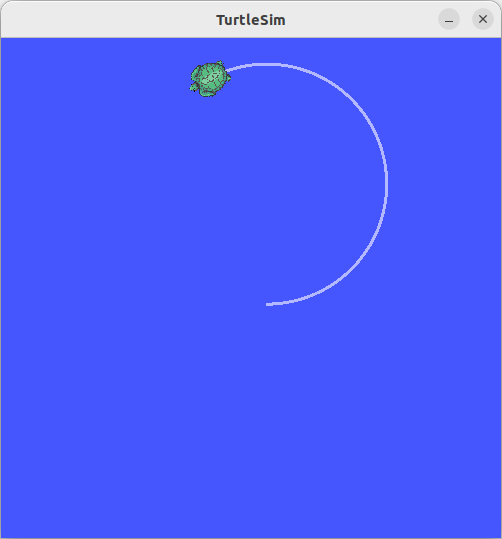

## rclpy_tutorial/ turtlesim/make_circle_with_turtle

##  

**참조 :**  <https://docs.ros.org/en/humble/Tutorials/Beginner-Client-Libraries/Writing-A-Simple-Py-Publisher-And-Subscriber.html>

**튜토리얼 레벨 :**  초급

**빌드 환경 :**  colcon **/** Ubuntu 22.04 **/** Humble

이 튜토리얼에서는  `turtlesim`  패키지의 거북이를 원운동 시키는 코드를 작성해보자. 이미 거북이 원격조정 노드 작성 시 만들어둔 `turtle_pkg`에 `make_circle.py`를 추가하도록 하자. 

*작업* 경로를 `~/robot_ws/src/turtle_pkg/turtle_pkg`로 변경한다. 

```bash
cd ~/robot_ws/src/turtle_pkg/turtle_pkg
```

`ls`명령으로 파일 목록 확인

```bash
ls
getchar.py  __init__.py  __pycache__  remote_turtle.py
```

`make_circle.py`파일 편집

```bash
gedit make_circle.py &
```

```python
import rclpy
from rclpy.node import Node
from rclpy.qos import QoSProfile

from geometry_msgs.msg import Twist


class MakeCircle(Node):

    def __init__(self):
        super().__init__('make_circle')


def main(args=None):
    rclpy.init(args=args)
    node= MakeCircle()
    qos_profile = QoSProfile(depth=10)
    pub = node.create_publisher(Twist, '/turtle1/cmd_vel', qos_profile)
    tw = Twist()
    try:
        tw.linear.x = 1.25; tw.angular.z = 0.5
        while rclpy.ok():
        pub.publish(tw)
    except KeyboardInterrupt:
        node.get_logger().info('Keyboard Interrupt(SIGINT)')
    finally:
        tw.linear.x  =  tw.angular.z =  0.0; pub.publish(tw)
        node.destroy_node()
        rclpy.shutdown()
        
if __name__ == '__main__':
    main()
```


`setup.py` 파일 편집을 위해 경로를 `~/robot_ws/src/turtle_pkg`로 변경한다. 

```
cd ~/robot_ws/src/turtle_pkg
```


**`setup.py` 파일 편집**

```
gedit setup.py &
```


```python
from setuptools import find_packages
from setuptools import setup

package_name = 'turtle_pkg'

setup(
    name=package_name,  
    version='0.0.0',
    packages=find_packages(exclude=['test']),
    data_files=[
        ('share/ament_index/resource_index/packages',
            ['resource/' + package_name]),
        ('share/' + package_name, ['package.xml']),
    ],
    install_requires=['setuptools'],
    zip_safe=True,
    maintainer='gnd0',
    maintainer_email='greattoe@gmail.com',
    description='TODO: Package description',
    license='TODO: License declaration',
    tests_require=['pytest'],
    entry_points={
        'console_scripts': [
                'remote_turtle   = turtle_pkg.script.remote_turtle:main',
            	
        ],
    },
```

`entry_points` 필드의 `console_scripts'` 항목에 다음 내용을 추가한다.

```python
'make_circle   = turtle_pkg.script.make_circle:main',
```

편집 완료된 `setup.py`는 다음과 같다.

```python
from setuptools import find_packages
from setuptools import setup

package_name = 'turtle_pkg'

setup(
    name=package_name,  
    version='0.0.0',
    packages=find_packages(exclude=['test']),
    data_files=[
        ('share/ament_index/resource_index/packages',
            ['resource/' + package_name]),
        ('share/' + package_name, ['package.xml']),
    ],
    install_requires=['setuptools'],
    zip_safe=True,
    maintainer='gnd0',
    maintainer_email='greattoe@gmail.com',
    description='TODO: Package description',
    license='TODO: License declaration',
    tests_require=['pytest'],
    entry_points={
        'console_scripts': [
                'remote_turtle   = turtle_pkg.remote_turtle:main',
            	'make_circle   = turtle_pkg.make_circle:main',
            	
        ],
    },
```


**빌드**

패키지 빌드를 위해 작업 경로를 `~/robot_ws`로 변경한다.

```bash
cd ~/robot_ws
```

빌드

`colcon_build` 또는 `colcon build --symlink-install`명령으로 빌드하면 `~/robot_ws/src`에 있는 모든 패키지를 다시 빌드한다. 이 때 `--packages -select`옵션을 사용하면 빌드할 패키지를 특정할 수 있다. 다음 명령으로 `turtle_pkg`패키지만 빌드한다.

```bash
colcon build --symlink-install --packages -select turtle_pkg
```

새로 빌드한 패키지 정보 반영을 위해 다음 명령을 실행한다.

```bash
source ~/robot_ws/instal/local_setup.bash
```

먼저 `turtlesim_node`를 구동 후, 다음 명령을 실행한다. 

```
ros2 run turtle_pkg make_circle
```

`turtlesim`패키지의 거북이가 원을 그리며 이동하는 것을 확인한다.





[튜토리얼 목록](../README.md) 


