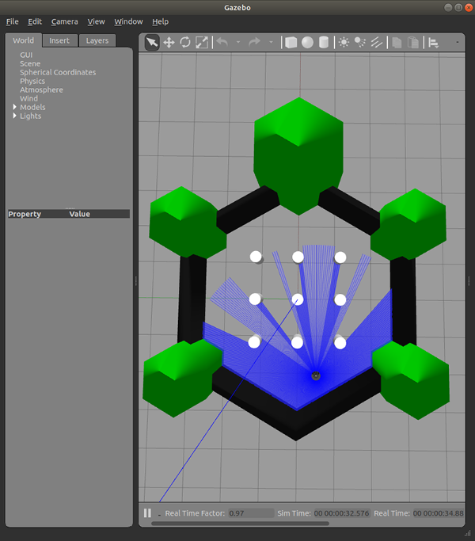
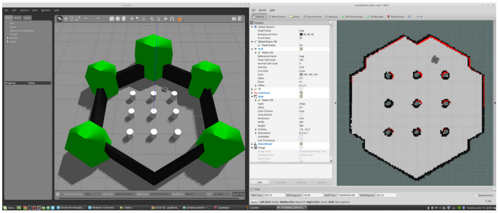
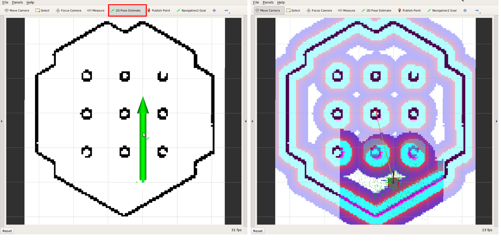
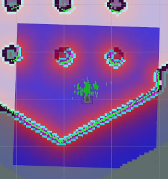
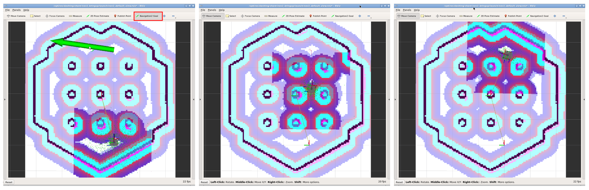
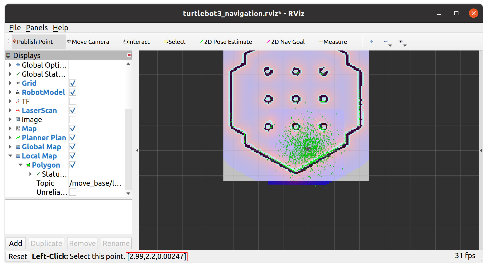

## Turtlebot3 시뮬레이션


---

## Turtlebot3 Gazebo 시뮬레이션

**Turtlebot3 Gazebo** 시뮬레이션을 이용하여 **SLAM** / **Navigation** 실습을 해보자.

**출처 :**  <https://docs.robotis.com/docs/systems/turtlebot3/simulation/gazebo_simulation>

**튜토리얼 레벨 :**  초급

**선수 학습 :**  ROS 튜토리얼

**빌드 환경 :**  colcon **/** Ubuntu 22.04 **/** Humble

---

 #### Gazebo 설치

```bash
sudo apt install ros-humble-gazebo-*
```


#### Cartographer 설치 

Cartographer는 SLAM(Simultaneous Localization and Mapping)방법 중 한가지이다.

```bash
sudo apt install ros-humble-cartographer\
sudo apt install ros-humble-cartographer-ros
```


 #### Navigation2 설치

```bash
sudo apt install ros-humble-navigation2 Navigation2\
sudo apt install ros-humble-nav2-bringup
```


#### 터틀봇3 패키지 설치

ROS Humble 버전의 터틀봇3 패키지는 바이너리 설치파일이 일부 지원되지 않는 패키지들이 있어 소스코드를 받아 빌드하여 설치해야 한다. 따라서 워크스페이스로 소스코드를 가져와야 하는데 관리 편의를 위해 별도의 워크스페이스를 만들어 사용하기로 한다.

**워크스페이스 생성 및 경로변경**

```bash
 mkdir -p ~/turtlebot3_ws/src && cd  ~/turtlebot3_ws/src
```


**터틀봇3 패키지 소스코드 복제**

```bash
git clone -b humble https://github.com/ROBOTIS-GIT/DynamixelSDK.git
```

```bash
git clone -b humble https://github.com/ROBOTIS-GIT/turtlebot3_msgs.git
```

```bash
git clone -b humble https://github.com/ROBOTIS-GIT/turtlebot3.git
```


**터틀봇3 패키지 빌드**

```bash
cd ~/turtlebot3_ws && colcon build --symlink-install
```

**터틀봇3 패키지 빌드결과 시스템에 반영**

```bash
source ~/turtlebot3_ws/install/local_setup.bash
```


#### 3. 터틀봇3 ROS 시뮬레이션 패키지 설치

**`~/turtlebot3_ws/src`로 작업경로 변경**

```bash
cd ~/turtlebot3_ws/src
```


**터틀봇3 ROS 시뮬레이션 패키지 소스코드 복제**

```bash
git clone -b humble https://github.com/ROBOTIS-GIT/turtlebot3_simulations.git
```


**빌드**

```bash
cd ~/turtlebot3_ws && colcon build --symlink-install --packages-select turtlebot3_gazebo
```

**빌드 결과 시스템에 반영**

```bash
source ~/turtlebot3_ws/install/local_setup.bash
```


**터틀봇3 모델 설정**

터틀봇3는 `burger`, `wapple`, `wapple_pi` 3가지 모델이 있으므로 어떤 모델을 시뮬레이션할 것인가를 정해줘야한다.

```bash
export TURTLEBOT3_MODEL=burger
```

터미널을 열 때 마다 자동으로 적용되도록 `~/.bashrc`에 `export TURTLEBOT3_MODEL=burger`를 추가하자.

```bash
gedit ~/.bashrc
```

`export ROS_HOSTNAME`을 찾아서 그다음 행에 에 `export TURTLEBOT3_MODEL=burger` 추가 후, 저장, 종료한다.

터미널을 새로열면  `export TURTLEBOT3_MODEL=burger`가 자동 반영된다.

현재 이미 열려 있는터미널에 반영하려면 해당 터미널에서`~/.bashrc`를 `source`한다.

```bash
source ~/.bashrc
```


#### 4. `turtlebot3_world` 에서 `Gazebo`시뮬레이션구동

```bash
roslaunch turtlebot3_gazebo turtlebot3_world.launch use_sim_time:=true
```




#### 5.SLAM 노드구동

**5.1 로봇 모델 설정**

```bash
export TURTLEBOT3_MODEL=burger
```

**5.2 SLAM 구동**

```bash
 ros2 launch turtlebot3_gazebo turtlebot3_world.launch.py use_sim_time:=true
```

**5.3 원격 조종 노드 구동**

```bash
roslaunch turtlebot3_teleop turtlebot3_teleop_key.launch
```

```bash
oslaunch turtlebot3_teleop turtlebot3_teleop_key.launch

 Control Your TurtleBot3!
 ---------------------------
 Moving around:
        w
   a    s    d
        x

 w/x : increase/decrease linear velocity
 a/d : increase/decrease angular velocity
 space key, s : force stop

 CTRL-C to quit
```




**5.4 작성된 지도 저장**

위 오른쪽 그림과 같이 모든 영역을 탐색하여 밝은 영역으로 만들었다면 현재 상태를 지도로 저장한다.

```bash
rosrun map_server map_saver -f ~/map
```

지도저장 확인

```bash
ls -al ~/map.*
-rw-rw-r-- 1 gnd0 gnd0 14275  5월  3  2023 /home/gnd0/map.pgm
-rw-rw-r-- 1 gnd0 gnd0   132  7월 16 16:00 /home/gnd0/map.yaml
```


#### 6. Navigation 구동

**6.1 로봇 모델 설정**

```bash
export TURTLEBOT3_MODEL=burger
```

**6.2 Navigation 구동**

```bash
 ros2 launch turtlebot3_navigation2 navigation2.launch.py use_sim_time:=True map:=$HOME/map.yaml
```


**6.3 Pose Estimate**

**내비게이션을 실행하기 전에 초기 자세 추정을** 수행해야 합니다. 이 과정은 정확한 내비게이션에 필수적인 AMCL 매개변수를 초기화합니다. TurtleBot3는 LDS 센서 데이터를 사용하여 지도에 정확하게 위치해야 하며, 해당 데이터가 표시된 지도와 정확히 겹쳐야 한다.

1. RViz2 메뉴에서 `2D Pose Estimate`버튼 클릭 .
2. 지도에서 로봇의 실제 위치를 클릭하고 큰 녹색 화살표를 로봇이 바라보는 방향으로 드래그하세요.
3. 저장된 지도에 LDS 센서 데이터가 겹쳐질 때까지 1단계와 2단계를 반복합니다.



**6.4 키보드 원격 조종 노드 실행**

```
roslaunch turtlebot3_teleop turtlebot3_teleop_key.launch
```

로봇을 천천히 움직여 녹색 점들로 표시된 지도상에서의 추정된 로봇의 위치를 일치시킨다.

  

6.5 Navigation 목표 위치 설정

1. RViz2 메뉴에서 `Navigation2 Goal`버튼 클릭.
2. 지도에서 로봇의 목적지를 클릭하고 녹색 화살표를 로봇이 향할 방향으로 드래그.
   - 이 녹색 화살표는 로봇의 목적지를 나타내는 표식입니다.
   - 화살표의 시작점은 목적지의 좌표이고, 각도는 화살표 의 방향에 따라 결정된다.
   - `x`, `y`, `θ` 값이 설정되는 즉시 TurtleBot3는 목적지를 향해 즉시 이동을 시작한다.




**맵에서 임의의 위치의 좌표 알아내기**


위 그림에 표시한  `publish point`버튼을 클릭하면, 아래 그림에 표시한 위치에 마우스 포인터가 위치한 맵의 좌표가 나타난다.




[튜토리얼 목록](../README.md) 


