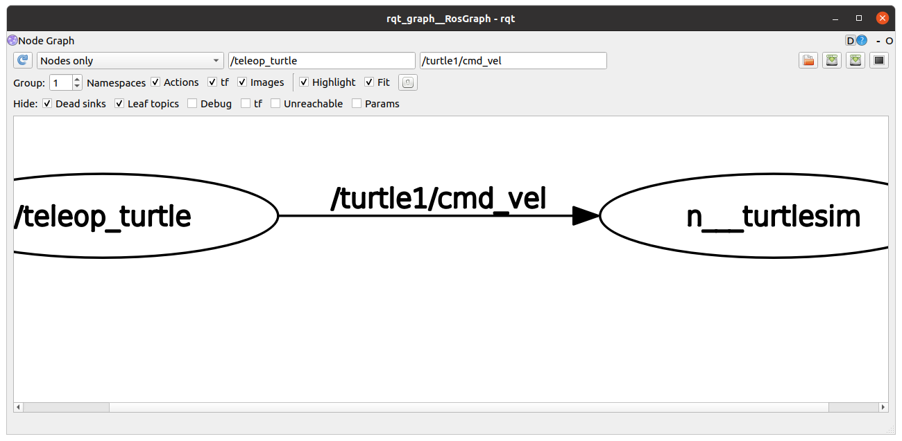
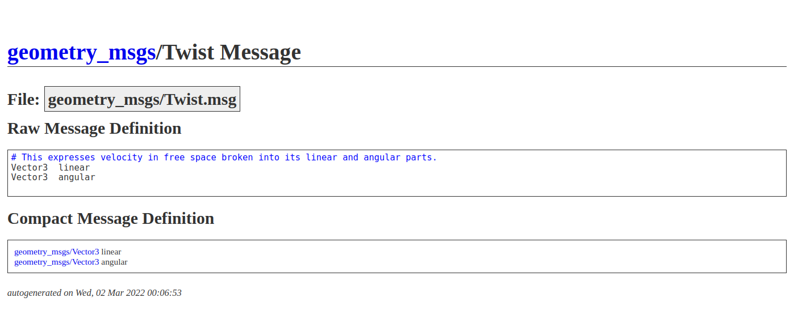
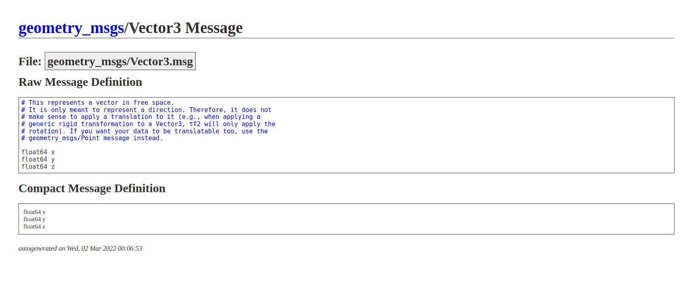

## rclpy_tutorial/ turtlesim/teleop_key

##  

**참조 :**  <https://docs.ros.org/en/humble/Tutorials/Beginner-Client-Libraries/Writing-A-Simple-Py-Publisher-And-Subscriber.html>

**튜토리얼 레벨 :**  초급

**빌드 환경 :**  colcon **/** Ubuntu 22.04 **/** Humble

이 튜토리얼에서는  `turtlesim`  패키지의 거북이를 키보드로 제어하는 `turtle_teleop_key`노드와 같은 기능을 제공하는 사용자 정의 노드를 작성해보려 한다.

##### 1. 사전 조사. 

어떤 형식의 무슨 토픽을 발행해야 하는 가를 조사하기 위해 `turtlesim` 패키지의 `turtlesim_node` 와 `turtle_teleop_key` 노드를 실행 후, `rqt_graph`를 실행한다. 

```bash
ros2 run turtlesim turtlesim_node
```


```bash
ros2 run turtlesim turtle_teleop_key
```


```bash
rqt_graph
```

`rqt_graph`를 실행하면 아래와 같은 그해프를 볼 수 있다. 이 그래프가 나타내는 것은 `teleop_turtle` 노드가 `/turtle1/cmd_vel` 토픽을 발행 중이며, `turtlesim`노드가 해당 토픽을 구독 중이라는 것이다. 따라서 우리가 작성해야 할 노드는 토픽 퍼블리셔이며 발행할 토픽명은 `/turtle1/cmd_vel`이다. 




이제 필요한 정보는 `turtle1/cmd_vel` 토픽이 어떤 토픽인가 이다. 이를 알아내기 위해 `ros2 topic type` 명령을 이용하자. 

```bash
ros2 topic type /turtle1/cmd_vel
geometry_msgs/msg/Twist
```

거북이를 제어하는 `/turtle1/cmd_vel`토픽의 형식이 `geometry_msgs/msg/Twist`형식이라는 것을 알아냈다. 웹 브라우저에서 `geometry_msgs/msg/Twist` 를 검색해 보면 아래와 같은 결과를 얻을 수 있다. 



해석하자면 `Twist` 메세지는 `Vector3` 형식의 `linear`메세지와 와 역시 `vector3` 형식의 `angular` 메세지가 합쳐진 형식이다. `vector3`를 검색해 보면 다음과 같은 결과를 찾을 수 있었다.



정리하자면 `Twist` 메세지는

`linear.x`, `linear.y`, `linear.z` 와

`angular.x, `angular.y`, ``angular.z` 로 이루어져 있다는 의미이다. 새로운 터미널에서

 `ros2 topic echo /turtle1/cmd_vel` 명령을 실행 후, 


`turtle_teleop_key` 노드를 실행한 창에서 `↑` , `↓`,   `←` , `→`키를 눌러 보면 `ros2 topic echo /turtle1/cmd_vel` 명령을 실행한 창에서 다음과 같은 반응을 관찰할 수 있다.

```bash
ros2 topic echo /turtle1/cmd_vel 
linear:
  x: 2.0
  y: 0.0
  z: 0.0
angular:
  x: 0.0
  y: 0.0
  z: 0.0
---
linear:
  x: -2.0
  y: 0.0
  z: 0.0
angular:
  x: 0.0
  y: 0.0
  z: 0.0
---
linear:
  x: 0.0
  y: 0.0
  z: 0.0
angular:
  x: 0.0
  y: 0.0
  z: 2.0
---
linear:
  x: 0.0
  y: 0.0
  z: 0.0
angular:
  x: 0.0
  y: 0.0
  z: -2.0
```

정리하자면  `↑` 키가 눌리면 `linear:x`의 값이 `2.0`이되고, 거북이는 전진하고,

​                     `↓`키가 눌리면 `linear:x`의 값이 `-2.0`이되고, 거북이는 후진하며, , 

  `←` 키가 눌리면 `angular:z`의 값이 `2.0`이되고, 거북이는 좌로 회전하고,

 `→`키가 눌리면 `angular:z`의 값이 `-2.0`이되고, 거북이는 우로 회전한다. 이 사실들을 바탕으로 `↑` , `↓`,   `←` , `→`키를 각각 `w` , `s`,   `a` , `d`키로 바꾼 `remote_turtle` 노드를 작성해보자. 이 외에도 `turtlesim`노드의 거북이를 제어하는 코드를 추가할 계획이므로 패키지 이름은 `turtle_pkg`로 정하도록 하자.

*작업* 경로를 워크스페이스`~/robot_ws` 의 `src` 폴더로 변경한다. 

```bash
cd ~/robot_ws/srcb
```

`turtlesim` 패키지의 거북이 관련 사용자 정의 패키지 `turtle_pkg` 생성

```bash
ros2 pkg create turtle_pkg --build-type ament_python
```

`~/robot_ws/src/turtle_pkg/turtle_pkg`폴더로 작업 경로 변경

```bash
cd ~/robot_ws/src/turtle_pkg/turtle_pkg
```

`ls` 명령으로 작업경로에 `__init__.py`파일의 존재를 확인한다.

```bash
ls
__init__.py
```

`__init__.py`파일과 같은 경로에 키보드 입력을 받는  `getchar.py`를 작성한다. (이 코드는 ROS2 노드는 아니다. 키보드 입력을 받기위한 일종의 사용자 라이브러리 이다.)

```bash
gedit getchar.py &
```

```python
import os, time, sys, termios, atexit, tty
from select import select
  
# class for checking keyboard input
class Getchar:
    def __init__(self):
        # Save the terminal settings
        self.fd = sys.stdin.fileno()
        self.new_term = termios.tcgetattr(self.fd)
        self.old_term = termios.tcgetattr(self.fd)
  
        # New terminal setting unbuffered
        self.new_term[3] = (self.new_term[3] & ~termios.ICANON & ~termios.ECHO)
        termios.tcsetattr(self.fd, termios.TCSAFLUSH, self.new_term)
  
        # Support normal-terminal reset at exit
        atexit.register(self.set_normal_term)      
      
    def set_normal_term(self):
        termios.tcsetattr(self.fd, termios.TCSAFLUSH, self.old_term)
  
    def getch(self):        # get 1 byte from stdin
        """ Returns a keyboard character after getch() has been called """
        return sys.stdin.read(1)
  
    def chk_stdin(self):    # check keyboard input
        """ Returns True if keyboard character was hit, False otherwise. """
        dr, dw, de = select([sys.stdin], [], [], 0)
        return dr
```


##### `turtlsim`노드의 거북이 원격 조종 노드 `remote_turtle.py`작성

```
gedit  remote_turtle.py &
```

```python
import rclpy
from rclpy.node import Node
from rclpy.qos import QoSProfile

from geometry_msgs.msg import Twist
from turtle_pkg.getchar import Getchar

msg = """
==========================
 turtlesim Keyboard Teleop
==========================

w : move forward
s : move backward

a : rotate left
d : rotate right

SPACE : Stop

CTRL+C, q : Quit
--------------------------
"""

class RemoteTurtle(Node):

    def __init__(self):
        super().__init__('remote_turtle')


def main(args=None):
    rclpy.init(args=args)
    node= RemoteTurtle()
    qos_profile = QoSProfile(depth=10)
    pub = node.create_publisher(Twist, '/turtle1/cmd_vel', qos_profile)
    tw = Twist()
    kb = Getchar()
    key = ' '
    count = 0
    try:
        print(msg)
        while rclpy.ok():
            if kb.chk_stdin():
                key = kb.getch()
                if      key == 'w':
                    print("move forward"); count += 1
                    tw.linear.x  = 2.0; tw.angular.z = 0.0; pub.publish(tw)
                elif key == 's':
                    print("move backward");count += 1
                    tw.linear.x = -2.0; tw.angular.z = 0.0; pub.publish(tw)
                elif key == 'a':
                    print("rotate left"); count += 1
                    tw.linear.x  = 0.0; tw.angular.z = 2.0; pub.publish(tw)
                elif key == 'd':
                    print("rotate right"); count += 1
                    tw.linear.x  = 0.0; tw.angular.z = -2.0; pub.publish(tw)
                elif key == ' ':
                    print("stop stop move");  count += 1
                    tw.linear.x  =  tw.angular.z =  0.0; pub.publish(tw)
                elif key == 'q' or key == 'Q':
                    break
                else: pass
            if count > 15:
                print(msg); count = 0
            else: pass
    except KeyboardInterrupt:
        node.get_logger().info('Keyboard Interrupt(SIGINT)')
    finally:
        tw.linear.x  =  tw.angular.z =  0.0; pub.publish(tw)
        node.destroy_node()
        rclpy.shutdown()
        
if __name__ == '__main__':
    main()
```


`setup.py` 파일 편집을 위해 경로를 `~/robot_ws/src/turtle_pkg`로 변경한다. 

```
cd ~/robot_ws/src/turtle_pkg
```


**`setup.py` 파일 편집**

```
gedit setup.py &
```


```python
from setuptools import find_packages
from setuptools import setup

package_name = 'turtle_pkg'

setup(
    name=package_name,  
    version='0.0.0',
    packages=find_packages(exclude=['test']),
    data_files=[
        ('share/ament_index/resource_index/packages',
            ['resource/' + package_name]),
        ('share/' + package_name, ['package.xml']),
    ],
    install_requires=['setuptools'],
    zip_safe=True,
    maintainer='gnd0',
    maintainer_email='greattoe@gmail.com',
    description='TODO: Package description',
    license='TODO: License declaration',
    tests_require=['pytest'],
    entry_points={
        'console_scripts': [
        ],
    },
)
```

`entry_points` 필드의 `console_scripts'` 항목에 다음 내용을 추가한다.

```python
'remote_turtle   = turtle_pkg.script.remote_turtle:main',
```

편집 완료된 `setup.py`는 다음과 같다.

```python
from setuptools import find_packages
from setuptools import setup

package_name = 'turtle_pkg'

setup(
    name=package_name,  
    version='0.0.0',
    packages=find_packages(exclude=['test']),
    data_files=[
        ('share/ament_index/resource_index/packages',
            ['resource/' + package_name]),
        ('share/' + package_name, ['package.xml']),
    ],
    install_requires=['setuptools'],
    zip_safe=True,
    maintainer='gnd0',
    maintainer_email='greattoe@gmail.com',
    description='TODO: Package description',
    license='TODO: License declaration',
    tests_require=['pytest'],
    entry_points={
        'console_scripts': [
                'remote_turtle   = turtle_pkg.script.remote_turtle:main',
        ],
    },
```


**빌드**

패키지 빌드를 위해 작업 경로를 `~/robot_ws`로 변경한다.

```bash
cd ~/robot_ws
```

빌드

```bash
colcon build --symlink-install
```

새로 빌드한 패키지 정보 반영을 위해 다음 명령을 실행한다.

```bash
. instal/local_setup.bash
```

`remote_turtle` 노드를 구동하려 `turtlesim` 노드의 거북이가 조종되는 가를 확인한다. 

```bash
ros2 run turtle_pkg remote_turtle 

==========================
 turtlesim Keyboard Teleop
==========================

w : move forward
s : move backward

a : rotate left
d : rotate right

SPACE : Stop

CTRL+C, q : Quit
--------------------------
```


[튜토리얼 목록](../README.md) 


