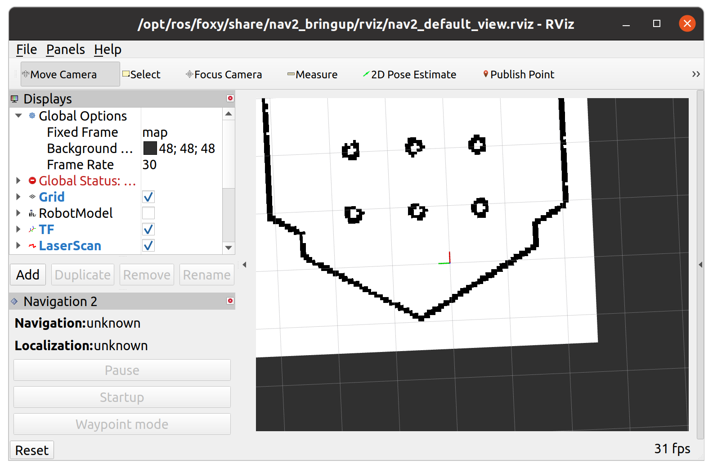

## ✅ Trtlebot3 `navigation`

**튜토리얼 레벨 :**  중급

**빌드 환경 :**  colcon **/** Ubuntu 20.04 **/** Foxy

---

`gazebo` 시뮬레이션 환경, 또는 실제 로봇을 구동한 환경에서 수행 가능하지만, 두 경우 모두 `map`이 작성되어 있어야 한다.

작성된 `map`이 `~/map.pgm`, `~/map.yaml`로 저장되어 있다면 해당 `map`으로 네비게이션을 구동하려면

`gazebo`환경에서는 다음 명령을 실행한다.

```
ros2 launch turtlebot3_navigation2 navigation2.launch.py use_sim_time:=True map:=$HOME/map.yaml
```

실제 로봇을 구동하는 경우에는 다음 명령을 실행한다.

```
ros2 launch turtlebot3_navigation2 navigation2.launch.py map:=$HOME/map.yaml
```

제대로 네비게이션이 구동되면 아래 좌측 그림과 같이 `rviz`화면이 나타난다.

 

```
ros2 topic list 
/amcl/transition_event
/amcl_pose
/clock
/cmd_vel
/controller_server/transition_event
/cost_cloud
/evaluation
/initialpose
/joint_states
/local_costmap/clearing_endpoints
/local_costmap/costmap
/local_costmap/costmap_raw
/local_costmap/costmap_updates
/local_costmap/footprint
/local_costmap/local_costmap/transition_event
/local_costmap/published_footprint
/local_costmap/voxel_grid
/local_plan
/map
/marker
/odom
/parameter_events
/particle_cloud
/particlecloud
/received_global_plan
/robot_description
/rosout
/scan
/tf
/tf_static
/transformed_global_plan
/waypoint_follower/transition_event
```


`/robot_description`토픽이 없다.


```
export TURTLEBOT3_MODEL=burger  # 또는 waffle / waffle_pi
ros2 run robot_state_publisher robot_state_publisher \
  $(ros2 pkg prefix turtlebot3_description)/share/turtlebot3_description/urdf/turtlebot3_${TURTLEBOT3_MODEL}.urdf

```

```bash
ros2 topic list 
/amcl/transition_event
/amcl_pose
/clock
/cmd_vel
/controller_server/transition_event
/cost_cloud
/evaluation
/initialpose
/joint_states
/local_costmap/clearing_endpoints
/local_costmap/costmap
/local_costmap/costmap_raw
/local_costmap/costmap_updates
/local_costmap/footprint
/local_costmap/local_costmap/transition_event
/local_costmap/published_footprint
/local_costmap/voxel_grid
/local_plan
/map
/marker
/odom
/parameter_events
/particle_cloud
/particlecloud
/received_global_plan
/robot_description #<===========
/rosout
/scan
/tf
/tf_static
/transformed_global_plan
/waypoint_follower/transition_event
```

`/robot_description`토픽이 나타났다.


[튜토리얼 목록](../README.md) 
