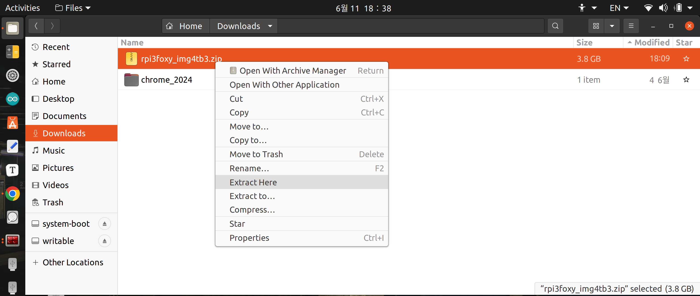
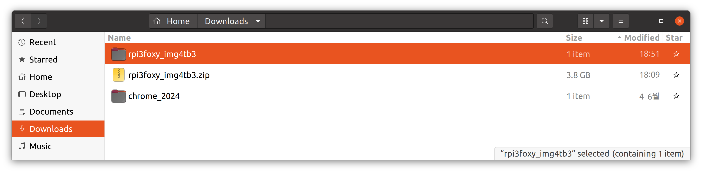
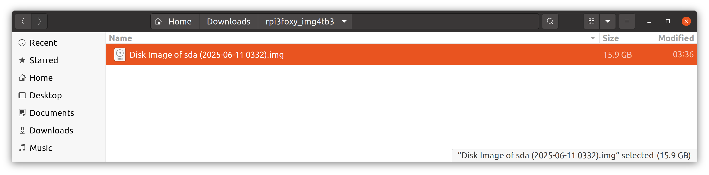

## turtlebot3_tutorial/ /sbc_setup

##  

[튜토리얼 목록](../README.md) 

**튜토리얼 레벨 :**  초급

**빌드 환경 :**  colcon **/** Ubuntu 20.04 **/** Foxy

터틀봇3에는 Mission 컴퓨터로서 라즈베리파이가 탑재되어 있다. 터틀봇3 운영을 위해 라즈베리파이에서 수행할 작업들을 알아보자. 

### 1. 라즈베리파이3 운영을 위한 디스크 작성

실습에 사용되는 터틀봇3에는 라즈베리파이3가 탑재되어 있다. 이 라즈베리파이3에서 ROS Foxy를 운영하기 위한 마이크로 SD카드를 만들어야한다.

#### 1.1 Download Ubuntu20.04 with ROS Foxy Disk Image for Raspberry Pi3

터틀봇3 제조사인 로보티즈 사에서 해당 이미지를 제공(로보티즈 터틀봇3 emanual)해 왔으나 2023년 이후 더이상 Foxy 이미지는 제공되지 않는다.

[로보티즈 터틀봇3 emanual](https://emanual.robotis.com/docs/en/platform/turtlebot3/sbc_setup/#sbc-setup) 

아래 링크에서 필자가 백업해 둔 라즈베리파이3용 ROS Foxy 이미지를 다운로드 받을 수 있다.

[Foxy 이미지 다운로드 링크1](https://www.dropbox.com/scl/fi/o5kkhc9d2695twt88bb8i/rpi3foxy_img4tb3.zip?rlkey=6xvjoimi1bk2h0nyvpr9unyxe&st=ez05dd7d&dl=0) 

[Foxy 이미지 다운로드 링크2](https://drive.google.com/file/d/1q20nuzgn1hscabhbKBddwI6wlI9a2aC6/view?usp=drive_link)

다운받은 rpi3foxy_img4turtlebot3.zip 파일의 압축 해제를 위해 아래 그림과 같이 탐색기에서 `rpi3foxy_img4turtlebot3.zip`파일에 마우스 오른쪽 버튼을 클릭하여 열린 컨텍스트 메뉴에서 `Extract Here`메뉴를 선택한다.

압축해제가 완료되면 아래와 같이 `rpi3foxy_img4tb3`폴더가 생성된 것을 볼 수 있다.

생성된 `rpi3foxy_img4tb3`폴더를 열어보면 다음과 같이 15.9GB용량의 `Disk Image of sda(2025-06-11 0332).img`파일을 확인할 수 있다. 

#### 1.1 디스크 작성

키를 누른 후, 검색화면에서 `disks`를 입력한다. 

검색된 Disks앱을 실행한다. 

다음은 `rpi3foxy_img4tb3.img`이미지를 기록할 Micro SD카드를 삽입 전 `Disks`앱 실행화면이다.

이미지를 기록할 마이크로SD카드(16GB 이상 권장)를 리더기에 삽입하면 아래와 같이 삽입된 SD카드 정보가 화면 좌측에 나타난다.

[튜토리얼 목록](../README.md) 

